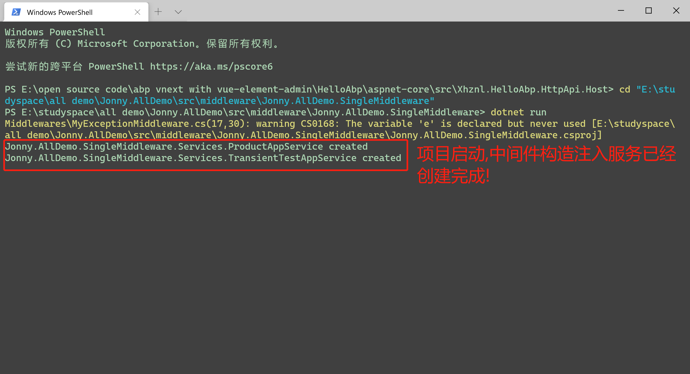
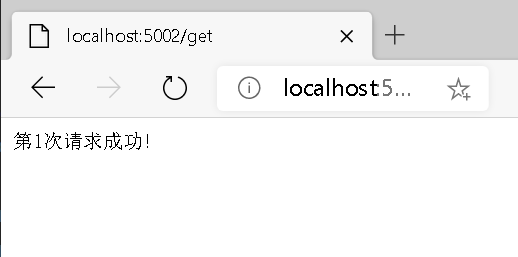
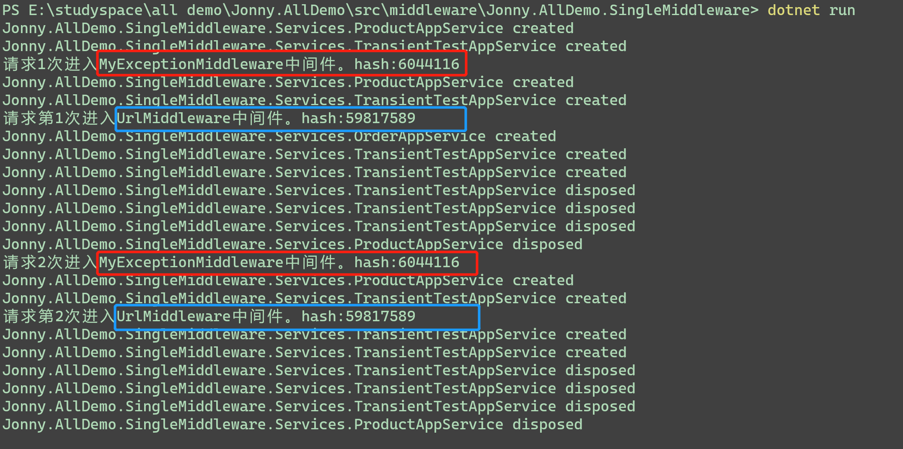
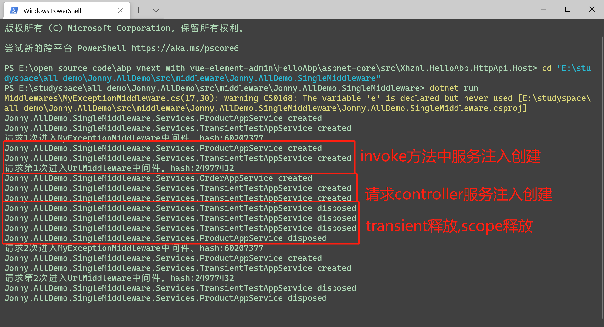
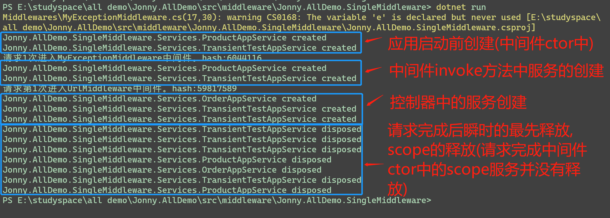
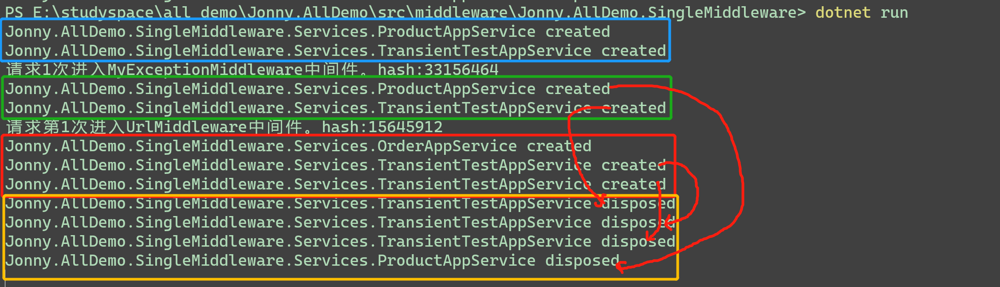

## 1.起源?
为什么会有这篇文章呢?
源于我看了老A的[aspnet core 3 框架揭秘](https://www.cnblogs.com/artech/) *请求管道* 篇产生的疑惑?

**三点疑惑:**
1. Singleton服务中注入Scoped服务产生内存泄露?
2. 关于中间件的生命周期是Singleton的?
3. 怎么避免中间件、Singleton服务中使用Scoped服务不产生内存泄漏?

## 2.知识面覆盖
示例中会覆盖到aspnet core相关的配置、依赖注入（周期）、中间件的知识点，若不清楚的需要先看看这些概念以及基本使用。

>收获：和我一起带着以上三个问题来进行验证也就会收获到相关知识点。

## 3. 测试环境准备

**创建三个服务:**
  1. IOrderAppService(singleton)
  2. IProductAppService(scoped)
  3. ITransientTestAppService(transient)
  
 **创建请求控制器:**
 ```c#
 public class ProductController : Microsoft.AspNetCore.Mvc.Controller
 {
     private int time = 1;
     private readonly IHostApplicationLifetime _lifetime;
     public ProductController(IProductAppService productAppService1,
         IProductAppService productAppService2,
         IOrderAppService orderAppService1,
         IOrderAppService orderAppService2,
         ITransientTestAppService transientTestAppService1,
         ITransientTestAppService transientTestAppService2,
         IHostApplicationLifetime lifetime)
     {
         _lifetime = lifetime;
     }

     [HttpGet]
     [Route("/get")]
     public Task<string> Get()
     {
         return Task.FromResult($"第{time++}次请求成功!");
     }

     [HttpGet]
     [Route("/stop")]
     public void Stop() => _lifetime.StopApplication();
 }
 ```

**创建中间件：**
```c#
public sealed class UrlMiddleware
{
    private int times = 1;
    private readonly RequestDelegate _next;
    public UrlMiddleware(RequestDelegate next,
        IProductAppService productAppService,
        ITransientTestAppService transientTestAppService)
    {
        //构造中的productAppService服务是由IApplicationBuilder.ApplicationServices根容器创建的
        _next = next;
    }

    public async Task InvokeAsync(HttpContext context,IProductAppService productAppService,ITransientTestAppService transientTestAppService)
    {
        //invoke中的productAppService其实是context.RequestServices子容器创建的。
        //这里的context.RequestServices子容器也是由IApplicationBuilder.ApplicationServices根容器创建来的。
        var productService = context.RequestServices.GetRequiredService<IProductAppService>();//使用解析的方式和上面方法中注入进来是一样的作用，切记是使用子容器RequestServices解析
        Console.WriteLine($"请求第{times++}次进入UrlMiddleware中间件。hash:{this.GetHashCode()}");
        await _next(context);
    }
}
```

**注册服务：**
```c#
service.AddTransient<ITransientTestAppService, TransientTestAppService>()
       .AddScoped<IProductAppService, ProductAppService>()
       .AddSingleton<IOrderAppService, OrderAppService>();
```
> 这里若使用的`IMiddleware`创建中间件也记得需要注册。

## 4.开始验证

#### 4.1 关于中间件的生命周期是Singleton的?

这里我们先验证下这个问题。为第一个问题做铺垫。
>文章中我就不做过多的代码介绍，主要是对代码片段的解释，有需要的可以看[源代码](https://github.com/jonny-xhl/my-demo/tree/master/src/middleware/Jonny.AllDemo.SingleMiddleware)

- 开始运行：
    ```bash
    dotnet run
    ```
    会注意到中间件构造中注入的服务会在项目*启动完成前*就会创建完成。
    

- 开始请求：

    输入**http://localhost:5002/get**， 这是因为配置了 `UseUrls`,也可以**直接使用**`UseSetting("urls"")`。
    
    > 使用`UseSetting`的key默认定义在`WebHostDefaults`和`HostDefaults`中
    
    为了验证问题我们请求两次。
    
    
    
    
    
    **分析总结：**
    从两次请求中可以确定不管是强类型的中间件还是按照约定（弱类型）的中间件都是单例的（Singleton）
    
    这里穿插一下关于Singleton\Scoped\Transient生命周期
    **控制台输出：**
    
    **分析总结：**
    - Scoped服务请求中只会创建一次并且请求完成后释放
    - Transient服务每一次都会重新创建并且请求完成后全部释放
    - Singleton整个应用程序周期内只会创建一次并且直到应用程序关闭时才会释放（慎用慎选择）

#### 4.2 Singleton服务中注入Scoped服务产生内存泄露?

调用**http://localhost:5002/stop** 进行远程关闭应用程序。**控制台输出：**

**分析总结：**
中间件构造中注入**scoped**服务时会跟随根容器的释放才会释放，相当于说就是会在整个应用程序生命周期中存在，所以也就容易导致**内存泄漏**。

从这里还没能表现出构造中的服务和invoke方法中的服务区别。。。**下面进行验证：**


**分析总结：**

    从图中画线中能看出请求完成后只有invoke方法中的scoped\transient服务释放了，中间件构造中的任何类型服务都不会得到释放，所以需要在中间件使用
    关于非singleten服务时在方法中进行注入，不要使用构造注入，这是为什么呢？
    
    其实invoke方法中的服务是通过子容器（context.RequestServices）创建而来的，所以跟随请求完成子容器释放也就会释放掉子容器内创建出的服务。
    context.RequestServices是由IApplicationBuilder.ApplicationServices根容器创建而来的。
    
    以上内容也只是使用中间件这种特殊来进行了测试，那么怎么来验证Singleton服务中注入scoped来进行验证呢？自行尝试？应该是不可以的哦？`ServiceProviderOptions`。

#### 4.3 怎么避免中间件、Singleton服务中使用Scoped服务不产生内存泄漏?

其实4.2中已经有了答案了。

如何避免？

在中间件中使用invoke方法中注入服务或者使用`context.RequestServices.GetRequiredService<>();`来解析服务，不推荐（反模式）。

在singleton服务中使用使用IServiceProvider来创建子容器解析。

> 要是以上内容有什么不对的地方欢迎也希望得到指点。

## 5 总结

从自己看书到自己写代码来验证以及写这篇文章多多少少算花了两天的时间，但是感觉还是有收获的，算是搞清楚了一些问题。

强烈推荐老A的 [aspnet core 3 框架揭秘](https://www.cnblogs.com/artech/) ，对深入aspnet core有很大的帮助，能
够对aspnet core中的知识点有一个大体轮廓。


