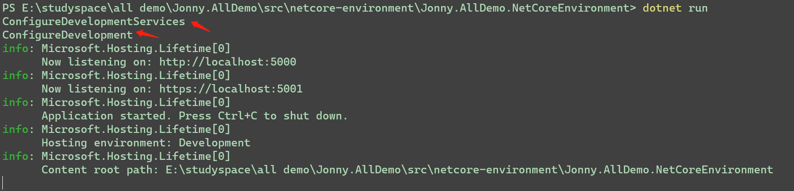
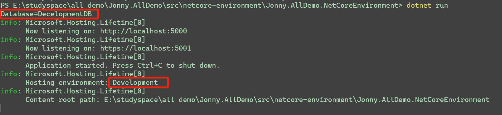
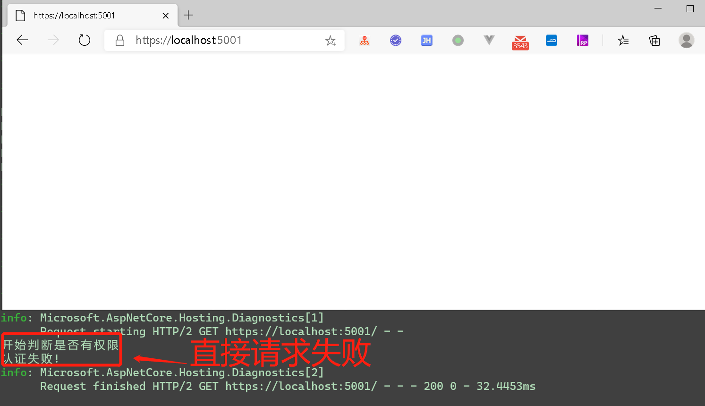
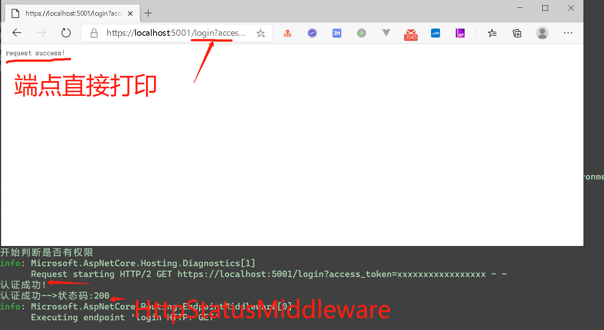

## 为何有这个demo呢?

出自于对**多环境**开发的支持，`IStartupFilter`尝试。

## 多环境

平时的开发中难免会遇到多环境模式，开发的时候使用开发模式、预发布使用预发布模式、生产模式。

1.Configure{Enviroment}

具体的测试参考`StartupWithEnviromentConfig`中的配置，将其添加到`UseStartup<>`中进行测试。

测试前进行环境变量设置：
```bash
setx ASPNETCORE_ENVIRONMENT "Development"
```

```c#
dotnet run
```
**结果：**



2.配置文件

分别建立对应环境的配置文件
- appsetting.Development.json
- appsetting.Production.json
- appsetting.Staging.json
- appsetting.json(公共配置文件，共同的配置可以放置到该文件中)

>这里需要注意一下的就是后面的环境配置文件和**公共**的配置文件有相同的配置时会被**覆盖**，没有的会**合并**

然后在配置中加入：
```c#
ConfigureAppConfiguration((context, builder) =>
{
    builder.AddJsonFile("JsonFile/appsetting.json");
    builder.AddJsonFile($"JsonFile/appsetting.{context.HostingEnvironment.EnvironmentName}.json");
})
```
>其实在*CreateDefaultBuilder*中已经默认做了这件事情，并且还做了很多其他的事情（环境变量、命令行、日志、ServiceProvider）等。

测试结果：


这样可以增对不同的环境做不同的配置环境支撑，是一个很好的选择,也推荐这么做，例如开发环境的数据库配置、测试版本数据库配置等。

## IStartupFilter

详细的解释参见[官方文档](https://docs.microsoft.com/zh-cn/aspnet/core/fundamentals/startup?view=aspnetcore-3.1#extend-startup-with-startup-filters) 。

本示例中我创建了两个**中间件**进行测试，详情*StartFilter*文件夹。

自定义Filter需要进行注册
```c#
services.AddSingleton<IStartupFilter, MyStartupFilter>();
```
MyStartupFilter实现
```c#
public Action<IApplicationBuilder> Configure(Action<IApplicationBuilder> next)
{
    return app =>
    {
        app.UseMiddleware<AuthticationMiddleware>();
        next(app);
    };
}
```
注册HttpStatusMiddleware
```c#
app.UseMiddleware<HttpStatusMiddleware>();
```
特意在最后还设置了一个端点
```c#
app.UseEndpoints(builder =>
{
    builder.MapGet("login", async context => { await context.Response.WriteAsync("request success!"); });
});
```
>当整个请求管道成功后，也就是`HttpStatusMiddleware`请求完成后就会进行端点判断，请求get方式并且路由/login就会匹配到。

失败的请求

成功的请求


使用`IStartupFilter`就做到了在请求管道之前附加请求处理。


